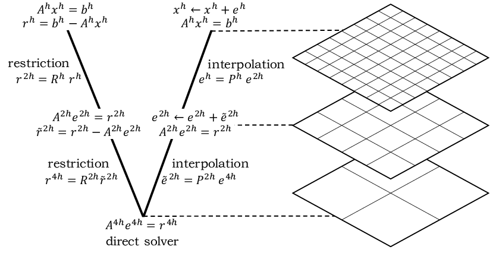
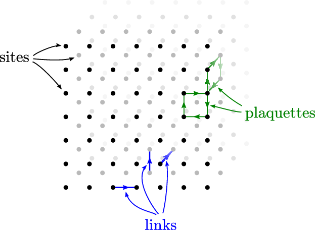

# Multigrid method
----
## 中文翻译
一般而言, 松弛迭代法对于求解Laplace方程是非常慢的, 即使在我们使用超松弛迭代法(overrelaxation method)进行加速的情况下. 其中的原因在于松弛迭代不能快速地将距离当前计算位置很远地方的效应纳入到当前的计算结果. 因此, 我们即将要考虑的多重网格法就是一种能够大幅度提升效率的方法, 其简要思想在于创建多种网格尺度并在上面建立松弛迭代法. 其中的关键点在于在逐渐粗糙的网格上使用松弛方法寻找待求函数解, 然后使用这些在粗糙网格上快速求得的函数解来决定精细网格上该次迭代的值. 这样子, 当我们在精细网格上使用松弛法迭代时, 我们就可以考虑到距离计算点较近一部分的函数效应(相比于一开始我们只考虑邻域四点应该是远了?). 打个比方来说, 我们定义我们的初始网格的间隔为$b=1$, 则我们的粗糙网格按照$b=2^n$来指定, 其中可发现$n$决定了网格的粗糙度并且一般被称为网格级别(grid level). 我们需要去决定如何用一个精细的网格解给粗糙的网格赋值, 然后进一步考虑如何用粗糙的网格给过呢个精细的网格赋值. 我们将前面描述的第一步称为**约束**(restriction), 第二步称为 **延拓**(prolongation). 对于这两种方法有很多种实现方式, 我们将在下面简要描述其中一种实现方式.(这里的延拓和约束好像有点和下文顺序相反啊, 知乎上用的是下文描述的定义)

我们将粗糙网格中的格点的中心位置(centers of sites of coarser grid?)都定在精细网格的某处格点的中心(centers of every other site of the fine grid). 也就是说若二元数对$(i,j)$表示精细网格的格点位置, 那么$(2i, 2j)$表示粗糙网格的格点位置. 对于精细网格, 其与粗糙网格重合的格点被赋和粗糙网格上该点的值(针对精细网格). 还是对于精细网格, 在不与粗糙网格重合的格点上, 若其仅有两个邻点和粗糙网格重合, 那么我们给该点赋值粗糙网格邻点的平均值; 若其有四个邻点和粗糙网格重合, 则取四点平均. 上面描述的方法构造了一种通过粗糙网格到精细网格的平滑方法, 也就是我们前面说的约束(restriction)步骤.

在**全加权**(full-weighting, 即周围一圈格点的信息完全利用)的延拓方法下, 每个粗糙网格上的格点接受一个$1/4$权重的重合精细格点的值, 四个$1/8$权重的邻近精细格点**(上下左右)**的值, 四个$1/16$权重的边角精细格点**(左上, 左下, 右上, 右下)**的值. 这些权重的和我们可以发现为$1/4 + 4(1/8)+ 4(1/16) = 1$, 而其也应当为$1$. 当然还有其他的延拓方法, 比如半加权(half-weighting), 其忽略了二阶邻近的边角格点(左上, 左下, 右上, 右下), 仅考虑$1/2$权重的重合精细格点以及$1/8$权重的邻点.

## 一些有用的资料
- [知乎的多重网格法介绍和讨论](https://www.zhihu.com/question/401605156/answer/3016876025)
- [一个直观图比较多的课程资料](https://www.sci.utah.edu/~beiwang/teaching/cs6210-fall-2016/mgintro.pdf)
- [MIT的ppt](https://math.mit.edu/classes/18.086/2006/am63.pdf)
- [知乎上的多重网格法效率对比](https://zhuanlan.zhihu.com/p/337970166)
- [USTC的数学类的课程](https://faculty.ustc.edu.cn/yxu/en/zdylm/737203/list/index.htm)

## 模块划分

